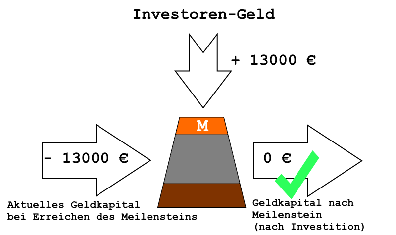
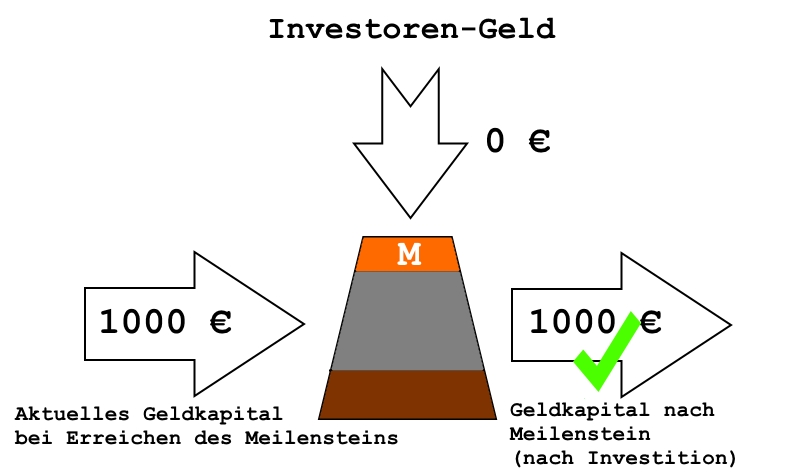
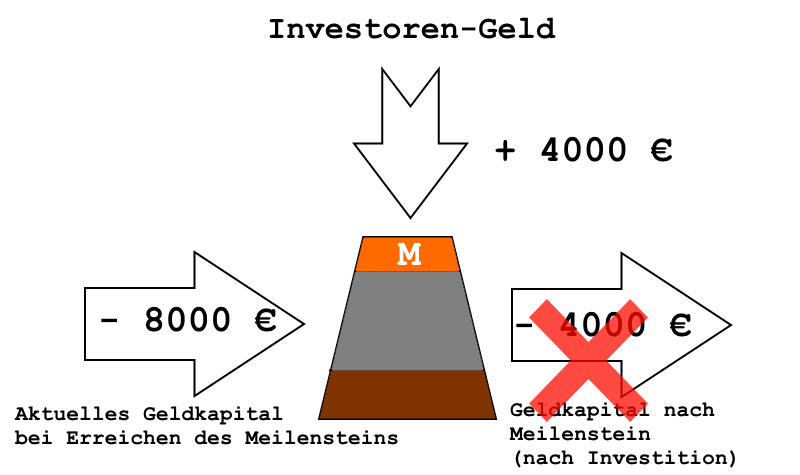

# Budgetmodell

## Einführung

Im Softwarepraktikum (SoPra) soll ein möglichst realitätsnahes Softwareentwicklungsprojekt durchgeführt werden. 
Zur Abbildung der realen Abhängigkeit von Geldkapital wird hierfür ein Budgetmodell auf Basis von **Spielgeld** in der Währung Euro (€) verwendet.
**Zu keiner Zeit besteht Anspruch auf die Auszahlung oder den Tausch des im SoPra verwendeten Spielgelds.**

Zum Beginn des SoPras bekommt jedes [Entwickler-Team](Begriffslexikon.md#entwicklerTeam) ein, von der Entwickleranzahl abhängiges, Start-Spielgeldkapital von den [Investoren](Begriffslexikon.md#investor).
Jede Woche hat das Entwickler-Team [laufende Kosten](Begriffslexikon.md#laufendeKosten) in Form von Fixkosten und Personalkosten zu bezahlen. 
Bei den Meilensteinen M2 bis M6 gibt es die Möglichkeit für die Abgaben zusätzliches Spielgeldkapital von den Investoren zu erhalten, um die laufenden Kosten zu decken und um das Kaptial zu vergrößern bzw. die weitere Entwicklung zu ermöglichen.
Hierbei darf das Spielgeldkapital bis zum nächsten Meilenstein zwar negativ werden, am Meilenstein muss man aber mindestens so viel zusätzliches Spielgeldkapital erhalten um mindestens ein neutrales Spielgeldkapital (0 €) als Endsaldo am [*Meilenstein-Ausgang*](Begriffslexikon.md#meilensteinAusgang) zu haben.
Die Entwickler-Teams die das nicht schaffen, können nicht weiter am SoPra teilnehmen. Die Anforderungen der Investoren an die Abgaben sind aber fair und man kann bei ausreichenden Abgaben mit ausreichenden Investitionen rechnen.

**Reklamationen zu Investitionen können ausschließlich bis zur Erstellung bzw. Veröffentlichung des Kontoauszugs zum nächsten Meilenstein beachtet werden, danach nicht mehr!**

### Kontoführung für Spielgeldkapital im Projekt-Wiki

Den Verlauf und der aktuelle Saldo werden auf einer **Wiki-Seite** im GitLab-Projekt von den [Investoren](Begriffslexikon.md#investor) eingetragen (([Beispiel Kontoauszüge](Konto.Beispiel.md)).
Aktualisierungen, bzw. die Buchung, erfolgen nur an Meilensteinen.
Es wird von den Investoren genau dokumentiert, für was wie viel Investitionen erhalten wurden.

## Investmenthöhe

Die Investoren haben während dem SoPra **insgesamt** grundsätzlich folgende Beträge zur Investition in die Teams zur Verfügung:

| Investment-Kategorie | Verfügbarer Gesamtbetrag pro (3er-)Team     |
|----------------------|---------------------------------------------|
| Review               | 500 € (Spielgeld) pro Teilnehmer pro Review |
| Dokumente            | 18000 € (Spielgeld)                         |
| Critical Features    | 20000 € (Spielgeld)                         |
| Additional Features  | 10000 € (Spielgeld)                         |
| Abnahme              | 8000 € (Spielgeld)                          |

## Beispiel

In der folgenden Tabelle wird beispielhaft für fünf Teams der Verlauf ihres Spielgeldkapitals komprimiert dargestellt.
Das Saldo ist **Fett**-gedruckt. Abzüge bzw. Gewinne (durch Investitionen oder Review-Teilnahmen), die das Saldo erst am Meilenstein beeinflussen sind ohne Hervorhebung.

|          | Meilenstein    | Team 1                   | Team 2                                           | Team 3                                            | Team 4                                                                           | Team 5                                                                                 |
|----------|----------------|--------------------------|--------------------------------------------------|---------------------------------------------------|----------------------------------------------------------------------------------|----------------------------------------------------------------------------------------|
| Woche 0  | M0             | **15000 €**                    | **15000 €**                                            | **15000 €**                                             | **15000 €**                                                                            | **15000 €**                                                                                  |
| Woche 1  |                | -4000 €                    | -4000 €                                            | -4000 €                                             | -4000 €                                                                            | -4000 €                                                                                  |
| Woche 2  |                | -4000 €                    | -4000 €                                            | -4000 €                                             | -4000 €                                                                            | -4000 €                                                                                  |
| Woche 2  | M1-Eingang     | **7000 €**                     | **7000 €**                                             | **7000 €**                                              | **7000 €**                                                                             | **7000 €**                                                                                   |
| Woche 2  | M1-Ausgang     | **7000 €**                     | **7000 €**                                             | **7000 €**                                              | **7000 €**                                                                             | **7000 €**                                                                                   |
| Woche 3  |                | -4000 €                    | -4000 €                                            | -4000 €                                             | -4000 €                                                                            | -4000 €                                                                                  |
| Woche 3  | M2-Eingang     | **3000 €**                     | **3000 €**                                             | **3000 €**                                              | **3000 €**                                                                             | **3000 €**                                                                                   |
| Woche 3  | M2-Investition | keine Reviewteilnahme: + 0 € | 4 Review-Teilnahmen: 2000 €                        | 6 Review-Teilnahmen: +3000 €                         | 6 Review-Teilnahmen: +3000 €                                                        | 6 Review-Teilnahmen: +3000 €                                                              |
| Woche 3  | M2-Ausgang     | **3000 €**                     | **5000 € **                                            | **6000 €**                                              | **6000 €**                                                                             | **6000 €**                                                                                   |
| Woche 4  |                | -4000 €                    | -4000 €                                            | -4000 €                                             | -4000 €                                                                            | -4000 €                                                                                  |
| Woche 4  | M3-Eingang     | **-1000 €**                    | **1000 €**                                             | **2000 €**                                              | **2000 €**                                                                             | **2000 €**                                                                                   |
| Woche 4  | M3-Investition | Dokumente schlecht: + 0 €   | Dokumente OK: +8000 €                              | Dokumente OK: +8000 €                               | Dokumente OK: +8000 €                                                              | Dokumente OK: +8000 €                                                                    |
| Woche 4  | M3-Ausgang     | **-1000 €**                   | **9000 €**                                             | **10000 €**                                             | **10000 €**                                                                            | **10000 €**                                                                                  |
| Woche 5  |                |                          | -4000 €                                            | -4000 €                                             | -4000 €                                                                            | -4000 €                                                                                  |
| Woche 6  |                |                          | -4000 €                                            | -4000 €                                             | -4000 €                                                                            | -4000 €                                                                                  |
| Woche 7  |                |                          | -4000 €                                            | -4000 €                                             | -4000 €                                                                            | -4000 €                                                                                  |
| Woche 8  |                |                          | -4000 €                                            | -4000 €                                             | -4000 €                                                                            | -4000 €                                                                                  |
| Woche 8  | M4-Eingang     |                          | **-7000 €**                                            | **-6000 €**                                             | **-6000 €**                                                                            | **-6000 €**                                                                                  |
| Woche 8  | M4-Investition |                          | Dokumente gut: +4000 €, Critical Features fehlen: + 0 € | Dokumente gut: + 4000 €, Critical Features OK: +6000 €  | Dokumente gut: +4000 €, Critical Features OK: +6000 €                                 | Dokumente gut: +4000 €, Critical Features OK: +6000 €                                       |
| Woche 8  | M4-Ausgang     |                          | **-3000 €**                                            | **4000 €**                                              | **4000 €**                                                                             | **4000 €**                                                                                   |
| Woche 9  |                |                          |                                                  | -4000 €                                             | -4000 €                                                                            | -4000 €                                                                                  |
| Woche 10 |                |                          |                                                  | -4000 €                                             | -4000 €                                                                            | -4000 €                                                                                  |
| Woche 11 |                |                          |                                                  | -4000 €                                             | -4000 €                                                                            | -4000 €                                                                                  |
| Woche 12 |                |                          |                                                  | -4000 €                                             | -4000 €                                                                            | -4000 €                                                                                  |
| Woche 12 | M5-Eingang     |                          |                                                  | **-12000 €**                                            | **-12000 €**                                                                           | **-12000 €**                                                                                 |
| Woche 12 | M5-Investition |                          |                                                  | Dokumente gleich: +0 €, Critical Features gut: +8000 € | Dokumente gleich: +0 €, Critical Features gut: +8000 €, Additional Features gut: +4000 € | Dokumente gleich: +0 €, Critical Features sehr gut: +12000 €, Additional Features gut: +4000 € |
| Woche 12 | M5-Ausgang     |                          |                                                  | **-4000 €**                                            | **0 €**                                                                                | **4000 €**                                                                                   |
| Woche 13 |                |                          |                                                  |                                                   | -4000 €                                                                            | -4000 €                                                                                  |
| Woche 13 | M6-Eingang     |                          |                                                  |                                                   | **-4000 €**                                                                            | **0 €**                                                                                  |
| Woche 13 | M6-Investition |                          |                                                  |                                                   | Abnahme ungenügend: +0                                                           | Abnahme OK: +2000 €                                                                      |
| Woche 13 | M6-Ausgang     |                          |                                                  |                                                   | **-4000 €**                                                                            | **2000 €**                                                                                   |
| Ergebnis |                | **nicht bestanden**          | **nicht bestanden**                                  | **nicht bestanden**                                   | **nicht bestanden**                                                                  | **bestanden**                                                                              |

## Ausführliche Beschreibung

### Investitionen nur an Meilensteinen

**Investitionen** der Investoren finden **ausschließlich an definierten Zeitpunkten, den Meilensteinen** statt. Wenn **nach der Investition das Spielgeldkapital mindestens 0 €** beträgt kann weiter gearbeitet werden, andernfalls nicht.

Beispiele für die mögliche Investition der Investoren an Meilensteinen und ob danach weiter garbeitet werden kann:

