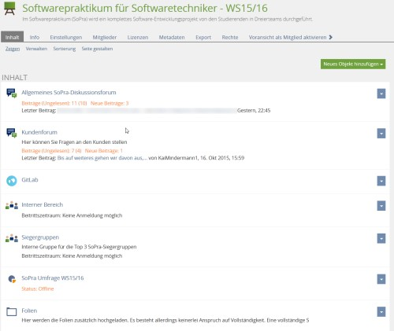
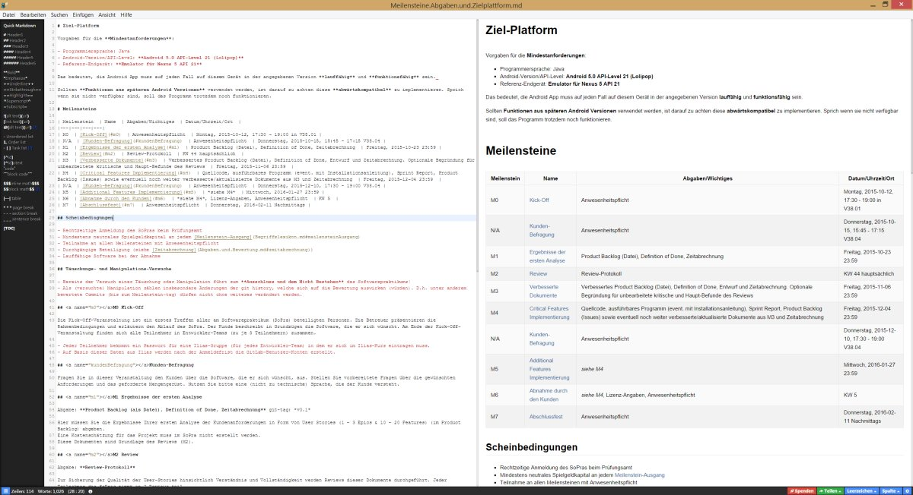
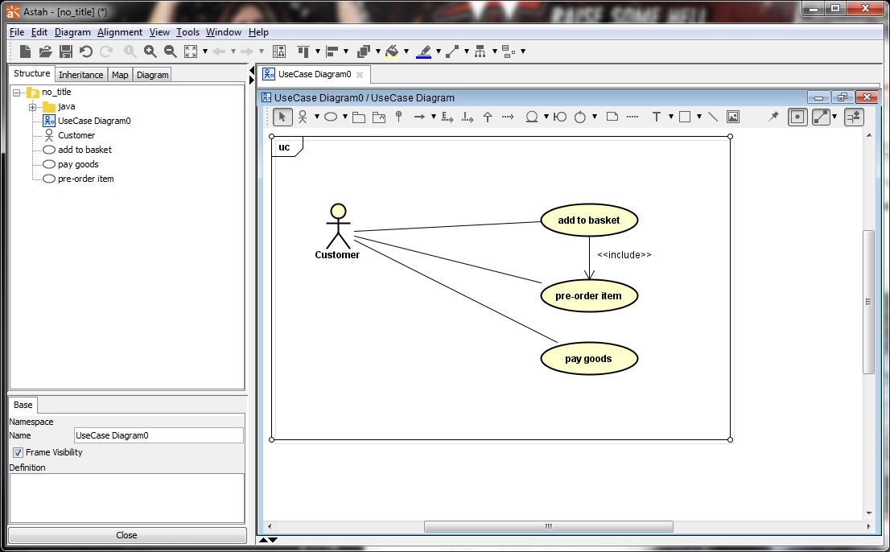

# Werkzeuge im Softwarepraktikum (SoPra)

##  Ilias

Zur Diskussion und Ankündigung wird ausschließlich auf die Lern-Plattform Ilias gesetzt. 

Es gibt dort einen separaten Kurs für das SoPra. Im Ilias-Kurs gibt es verschiedene Foren:
- Diskussionsforum: Allgemeines was nicht in die anderen Foren passt.
- GitLab: Diskussion die GitLab betrifft.
- Kundenforum: Fragen an den Kunden sowie Diskussion mit dem Kunden.
- **Team-interne** Foren: Diskussion im Team sowie mit dem Tutor (Kommentare zur/zu Bewertung/Investitionen)

## Git

Zur Verwaltung und Versionierung der Projektdateien, wie Dokumentation und Quellcode, wird im SoPra [*git*](https://git-scm.com/) verwendet.

Git ist ein **verteiltes** Versionsverwaltungssystem. Dabei werden Änderungen zunächst **lokal** gespeichert/in git eingetragen und bei Bedarf bzw. danach zu einem anderen, meist als zentral deklarierten, **entfernten** Repository übertragen.

Wichtig im SoPra:
- **Taggen von Abgaben** nach dem Format "v0.\<MeilensteinNummer\>" also beispielsweise "v0.1" für Meilenstein 1 oder "v0.4" für Meilenstein 4. Nur korrekt getaggte Repoistories werden für Abgaben akzeptiert!

Literatur:
- Git Live Online Tutorial [**Try Git**](http://try.github.com/)
- [Git Online Tutorial inkl. Installation](https://githowto.com/)
- [Git Online Tutorial für das Arbeiten mit Zweigen/Branches](http://learngitbranching.js.org/)
- [git-scm Book](https://git-scm.com/book/en/v2)
- [git cheatsheet](http://ndpsoftware.com/git-cheatsheet.html#loc=workspace;)
- [TortoiseGit](https://tortoisegit.org/)
- [GitTips / Versionierung von LibreOffice (odt-,ods-,odp-)Dateien](https://git.wiki.kernel.org/index.php/GitTips#How_to_use_git_to_track_OpenDocument_.28OpenOffice.2C_Koffice.29_files.3F)

## GitLab

Neben [Ilias](#ilias), was für die übergreifende Diskussion bereitsteht, gibt es im SoPra die Social Coding Plattform GitLab.

Erreichbar unter: [https://sopra.informatik.uni-stuttgart.de](https://sopra.informatik.uni-stuttgart.de)

Das SoPra-GitLab stellt das zentrale *git-repository* für die Projekte der Entwickler-Teams bereit. Dort werden die [Abgaben](Begriffslexikon.md#abgabe) erwartet. Weiterhin bietet die Weboberfläche die Darstellung und Bearbeitung der Markdown-Dokumente an sowie die nach Meilenstein 3 zu verwendenen Issues für die Abbildung der User Stories (Product Backlog).

- [GitLab Documentation](https://about.gitlab.com/documentation/)
- SSH-Keys [GitLab-Dokumentation](http://doc.gitlab.com/ce/ssh/README.html) (git-Bash verwenden) 

### Entwickler-Team / Repository / GitLab-Projekt

Für jedes Entwickler-Team gibt es ein eigenes **GitLab-Projekt**. Dieses ist nur für die Entwickler des Entwickler-Teams sowie die Investoren sichtbar. Hier findet die hauptsächliche Arbeit im SoPra statt.

### SoPra Dokumentation

Es gibt neben den einzelnen Projekten, an denen jeweils ein Entwickler-Team arbeitet, noch ein für alle sichtbares **SoPra-Dokumentations-Projekt** in dem diese Dokumentation abrufbar ist.

## Markdown

Für die Dokumentation eures Projekts sowie der Abgaben wird **Markdown** verwendet.

Markdown ist eine vereinfachte Auszeichnungssprache. Ihr Ziel ist es, das auch ohne weitere Werkzeuge oder Rendering die Ausgangsform leicht lesbar ist. Damit ist bereits ein einfacher Text-Editor geeignet Markdown-Dokumente zu lesen und zu erstellen. Sein volles Potenzial kann aber erst durch das Rendering (beispielsweise durch die SoPra-GitLab-Weboberfläche) erreicht werden.

Als Editor kommen verschiedene Programme in Frage. Ein Beispiel mit Live-Preview, Syntax-Highlighting und Tabellen-Unterstützung ist [Haroopad](http://pad.haroopress.com/). 
Es kann natürlich auch auf den in der GitLab-Weboberfläche integrierten Editor mit Preview-Ansicht zurückgegriffen werden.

- [Haroopad](http://pad.haroopress.com/)
- [GitLab Flavored Markdown](http://doc.gitlab.com/ce/markdown/markdown.html)

## Android

Die zu entwickelnde Anwendung soll auf dem Android-Betriebssystem laufen, sowie auf der Android-Softwareplattform basieren. 
Genaue Anforderungen finden sich bei der [Ziel-Plattform-Dokumentation](Meilensteine.Abgaben.und.Zielplattform.md).

## Android Studio

Zur Entwicklung der Android App soll [Android Studio](https://developer.android.com/sdk/index.html) verwendet werden. 

## RevAger

Für die Durchführung der Reviews wird das Programm [RevAger](http://www.revager.org/) verwendet. 
Dieses unterstützt sowohl bei der Planung als auch bei der Durchführung und Protokollierung eines technischen Reviews.

## UML

Für den Entwurf sollten Programme zur unterstützten Modellierung der Klassen- und Paketdiagramme verwendet werden.
Ein gut geeignetes Programm ist [Astah](http://www.astah.net/editions). 
- Kostenlos, aber nicht für kommerzielle Zwecke ist [Astah Community](http://www.astah.net/editions/community) verfügbar.
- Eine Lizenz gibt es aber für Studenten [Astah](http://www.astah.net/student-license-request) auch auf Anfrage kostenlos.

Als Alternative kann auch das Open-Source Programm [UMLet](http://www.umlet.com/) verwendet werden.

## Testen unter Android
Gurndsetzliche Infos zum Testen unter Android gibt es z.B. [hier](http://developer.android.com/tools/testing/testing_android.html).

## Testfallverwaltung

Für einen sytematischen Test sollte es eine Werkzeugunterstützung geben. Hiefür bietet sich z.B. [TSM](http://sourceforge.net/projects/tsmtest/) an. Hier können manuelle Test beschrieben und durchgeführt werden.

## Test-Coverage

Um die Testüberdeckung der Modultest zu messen kann man [Jacoco](http://eclemma.org/jacoco/) benutzten. Jacoco kann über [Gradle](https://docs.gradle.org/current/userguide/jacoco_plugin.html) in das Android-Studio-Projekt integriert werden oder auch über den Agenten auf der Konsole ausgeführt werden. 

## Nützliche andere Werkzeugs/Ressourcen

- [keep-a-changelog](https://github.com/olivierlacan/keep-a-changelog) ([keep-a-changelog.com](http://keepachangelog.com/))
- [Semantic Versioning](http://semver.org/) => tag names for version like "vX.Y.Z"
- [Scrum Guide](http://scrumguides.org/)