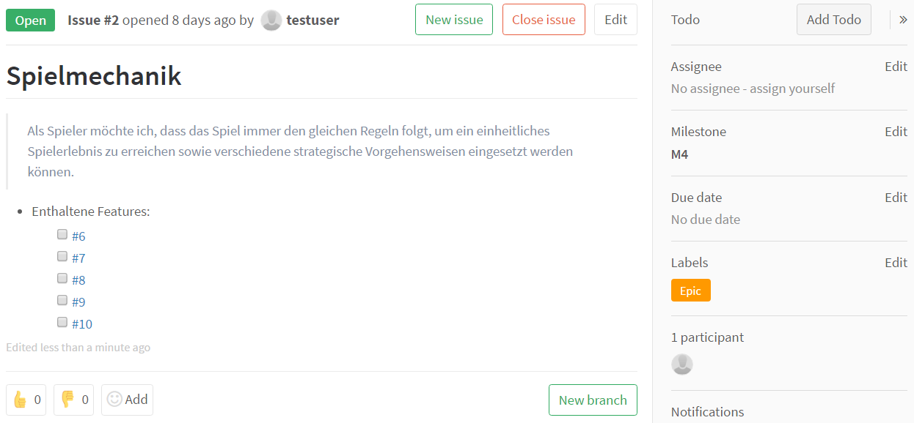

# Anforderungsdokumentation mit User Stories (im [Product Backlog](#productBacklog))

Zur leichtgewichtigen Dokumentation von Anforderungen wird im Softwarepraktikum (SoPra) eine teilweise hierarchische Ausprägung von [**User Stories**](Begriffslexikon.md#userStory) verwendet:

Eine User Story enthält eine in **Alltagssprache formulierte Anforderung** die üblicherweise nach folgendem Schema aufgebaut ist:

> Als **Rolle** möchte ich **Ziel/Wunsch**, um **Nutzen**.

##  Hierarchie und (Pflicht-)Inhalte

Zur Strukturierung der User Stories müssen diese je nach geschätztem Aufwand (zur vollständigen Bearbeitung) und Abstraktionsebene (Modularisierung) wie folgt aufgeteilt werden:

| Typ    | Aufwand | Beschreibung und Inhalt | Zusätzlicher Inhalt als GitLab-Issue |
|--------|--------|--------|--------|
| Epic | Monate | Titel/Name, Ausführliche Beschreibung | Links zu enthaltenen Features, Markierung mit GitLab-Label |
| Feature | Wochen | Title/Name, Beschreibung, Aufwandsschätzung, Akzeptanztests | Links zu enthaltenen Implementable Stories/Tasks, Markierung mit GitLab-Label |
| Implementable Story| Tage | Titel/Name, Beschreibung, Aufwandsschätzung, Akzeptanztests | Links zu enthaltenen Tasks, Markierung mit GitLab-Label |
| Task | Stunden | Titel/Beschreibung, [Aufwandsschätzung, tatsächlich aufgewendete Zeit](https://sopra.informatik.uni-stuttgart.de/help/workflow/time_tracking.md) (erst während der Task bearbeitet wurde) | N/A |

Dabei gehören die User Stories hierarchisch zusammen. Üblicherweise ergbit sich unterhalb eines Epics eine Baumstruktur, wie im folgenden Beispiel zu sehen. Es ist jedoch auch **möglich von der reinen Baumstruktur abzuweichen**. Es kann nämlich auch sinnvoll sein, ein Task direkt einem Feature zuzuordnen.

Siehe auch Hinweise zur [Abgabe des Product Backlogs](Abgaben.und.Bewertung.md#productBacklog).

### Beispiel

Betrachten wir als **Beispiel die Entwicklung eines Echtzeit-Strategiespiels**. Hierfür werden wichtige Bausteine wie eine Grafik-Engine, eine Netzwerk-Schnittstelle, eine Lokalisierung, eine Künstliche Intelligenz für Gegner und die eigentliche Spielmechanik benötigt. Dies sind in unserem Beispiel die *Epics*.

Für die Realisierung der Spielmechanik in dem Spiel werden folgende *Features* benötigt: Schadensmodell, Wirtschaftsmodell, Umgebungsmodell, Wegfindung und ein Spiel-Zustands-Modell. Diese werden alle in Implementable Stories und Tasks unterteilt. Wir betrachten hier nun das Wirtschaftsmodell.

Das Wirtschaftsmodell soll hauptsächlich "Geld verbrauchen" und "Geld erwirtschaften" ermöglichen, das sind die *Implementable Stories*.

Kommen wir zur Ebene der Tasks. Hier gilt es die Funktionalität entsprechend der Akzeptanzkriterien tatsächlich zu implementieren. Zusätzlich gehören hier weitere Aufgaben wie das Schreiben von Testfällen dazu.

# User Stories im gemeinsamen Product.Backlog.md
Bis zum Meilenstein 3 müssen die User Stories in einem einzigen Dokument in der Datei Product.Backlog.md gepflegt werden.
Innerhalb dieses Dokuments kann auf die Verlinkung zu anderen User Stories und Tasks verzichtet werden, da dies aus der Struktur bzw. Nummerierung ersichtlich wird.

## Beispiel für Epic im Product.Backlog.md
### Spielmechanik

> Als Spieler möchte ich, dass das Spiel immer den gleichen Regeln folgt, um ein einheitliches Spielerlebnis zu erreichen sowie verschiedene strategische Vorgehensweisen eingesetzt werden können.

Ausführliche Beschreibung...

## Beispiel für Feature im Product.Backlog.md
### Wirtschaftsmodell

> Als Spieler möchte ich ein Wirtschaftsmodell das Einfluss auf das Spiel hat.

- Aufwandsschätzung: **M**
- Akzeptanztests: 
    - [ ] Alle Einheiten kosten etwas
    - [ ] Alle Gebäude kosten etwas
    - [ ] Geld kann auf zwei unterschiedliche Arten erwirtschaftet werden

## Beispiel für Implementable Story im Product.Backlog.md
### Geld verbrauchen

> Als Spieler möchte ich, dass das Bauen von Einheiten und Gebäuden Geld verbraucht.

- Aufwandsschätzung: **7 Story Points**
- Akzeptanztests
  - [ ] Geld muss verbraucht werden können und wird dann auch tatsächlich verbraucht.
  - [ ] Das Abbrechen des Baus erstattet das komplette Geld wieder auf das Konto.

## Beispiel für Task im Product.Backlog.md
### Kontostand aktualisieren wenn Geld verbraucht wird

- Aufwandsschätzung: **0,25 Stunden**

#  User Stories als Issues in GitLab

## Beispiel für die Abbildung aller User Stories in Issues und Zuordnung zu einem Meilenstein

## Beispiel für die zu verwendenden Issue-Labels

## Beispiel für User Story (Epic) als GitLab-Issue

## Beispiel für User Story (Feature) als GitLab-Issue

## Beispiel für User Story (Implementable Story) als GitLab-Issue

## Beispiel für User Story (Task) als GitLab-Issue

