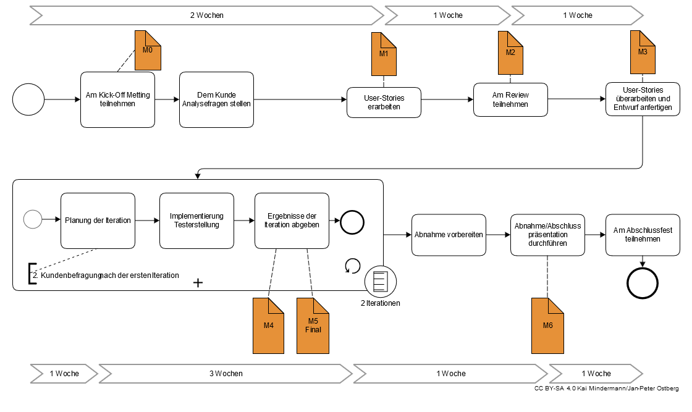

# Softwarepraktikum (SoPra) Wintersemester 2017/2018

## Überblick für Betreuer

Inhalt, agiler Ablauf, Bewertung nach Budgetmodell und vieles weiteres findet sich in der [allgemeinen Dokumentation](Dokumentation.Allgemein/Readme.md) die auch für die Teilnehmer bestimmt ist.

# Organisation

**Wichtig**: Beim Bereitstellen der Dokumentation nur den Unterordner **Dokumentation.Allgemein** veröffentlichen.

Zur [Vorbereitung und Durchführung des SoPras](Orga/Vorbereitung.und.Durchfuehrung.des.SoPras.md).

## Übersicht über die Dokumentation

- [Vorbereitung und Durchführung des SoPras](Orga/Vorbereitung.und.Durchfuehrung.des.SoPras.md)
- [Begriffslexikon](Dokumentation.Allgemein/Begriffslexikon.md)
- [Budgetmodell](Dokumentation.Allgemein/Budgetmodell.md)
- [Definition of Done](Dokumentation.Allgemein/Definition.of.Done.md)
- [Meilensteine, Abgaben, und Zielplattform](Dokumentation.Allgemein/Meilensteine.Abgaben.und.Zielplattform.md)
- [Abgaben und Bewertung](Dokumentation.Allgemein/Abgaben.und.Bewertung.md)
- [Tools](Dokumentation.Allgemein/Tools.md), [GitLab für SoPra-Betreuer](Orga/Gitlab.md)
- [Product Backlog / User Stories](Dokumentation.Allgemein/User.Stories.md)
- [Geräte und Hardware](Dokumentation.Allgemein/Geraete.Hardware.md)

## Vorlagen

Die Vorlagen, für abzugebende Dokumente als auch für das Android Studio Projekt, finden sich in einem separaten Repository, was als Anfangs-Projekt für jedes Entwickler-Team dient.
Vorlagen für Dokumente sind im Unterordner `doc`.

- Vorlage für Entwurfsdokument: `doc/Entwurf.md`
- Vorlage für Readme: `Readme.md`
- Vorlage für Product Backlog: `doc/Product.Backlog.md`
- Vorlage für optionale Begründung für nicht bearbeitete Befunde: `doc/Begruendung.md`
- Vorlage für Sprint Report: `doc/Sprint.Report.md`

Vorlagen für Tutoren:
- [Vorlage für Wiki Konto](Orga/templates/Wiki.Konto.md)